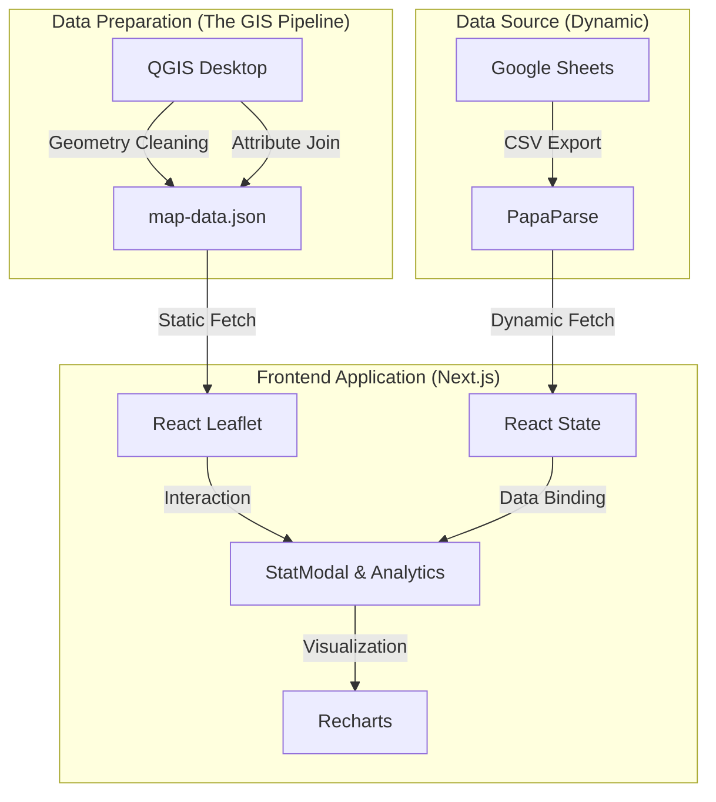

# GAIL — Geospatial Analytics & Intelligence Layer

[](https://nextjs.org/)
[](https://react.dev/)
[](https://tailwindcss.com/)
[](https://leafletjs.org/)
[](https://qgis.org/)

**GAIL** (Geospatial Analytics & Intelligence Layer) is a high-performance, premium geospatial dashboard designed for regional intelligence and statistical analysis. Focused on **Kota Malang**, GAIL integrates complex spatial geometries with dynamic live data to provide actionable insights into urban demographics, education, and land use.

---

## 🏛️ System Architecture

GAIL follows a modern, decoupled architecture designed for speed and scalability. It bridges the gap between static GIS data and dynamic web-based analytics.



---

## 🛠️ Tech Stack

- **Framework**: [Next.js](https://nextjs.org/) (App Router) — Providing optimized routing and server-side capabilities.
- **Mapping**: [Leaflet](https://leafletjs.org/) & [React-Leaflet](https://react-leaflet.js.org/) — Handling complex GeoJSON rendering and interactive map layers.
- **Styling**: [Tailwind CSS 4](https://tailwindcss.com/) — Next-generation CSS framework for a premium, dark-themed HUD aesthetic.
- **Data Fetching**: [PapaParse](https://www.papaparse.com/) — For fast, client-side parsing of live Google Sheets data.
- **Visualizations**: [Recharts](https://recharts.org/) — Interactive, responsive charts for demographic and land-use analysis.
- **Icons**: [Lucide React](https://lucide.dev/) — Minimalist, consistent iconography.

---

## 🗺️ Peran QGIS dalam Proyek (The Role of QGIS)

Dalam sistem GAIL, **QGIS** bertindak sebagai *Geospatial Data Processor* utama. Tanpa QGIS, data peta tidak dapat dikonsumsi dengan efisien oleh platform web.

Berikut adalah peran krusial QGIS dalam proyek ini:

1.  **Data Harmonization**: QGIS digunakan untuk memastikan koordinat sistem (CRS) menggunakan **WGS 84 (EPSG:4326)**, yang merupakan standar untuk pemetaan web seperti Leaflet.
2.  **Geometry Optimization**: File peta asli (biasanya berformat SHP atau KML) seringkali terlalu berat untuk web. QGIS digunakan untuk melakukan *Simplify Geometry* guna mengurangi ukuran file tanpa menghilangkan detail batas administrasi yang penting.
3.  **Attribute Management**: Mengatur tabel atribut agar kolom kunci (seperti `NAME_3` untuk nama kecamatan) sinkron dengan kunci data yang ada di **Google Sheets**.
4.  **GeoJSON Export**: QGIS berfungsi sebagai jembatan untuk mengekspor data vektor menjadi format `map-data.json` yang dapat dibaca oleh React secara langsung.

---

## 🚀 Key Features

- **Interactive District Explorer**: Visualisasi batas wilayah (Kecamatan) di Kota Malang dengan efek hover premium.
- **Live Google Sheets Integration**: Data statistik (Populasi, Luas Wilayah, Fasilitas Pendidikan) ditarik secara langsung dari cloud.
- **Advanced Analytics Modal**: Menampilkan perbandingan penggunaan lahan melalui *Pie Charts* dan metrik pendidikan secara mendalam.
- **High-Performance Map**: Menggunakan *Dark Mode basemaps* dari CartoDB untuk estetika intelijen modern.
- **System Status Monitoring**: HUD (Heads-Up Display) yang menunjukkan status pemrosesan data secara real-time.

---

## 📁 Project Structure

```text
├── app/                # Next.js App Router (Layouts & Pages)
├── components/         # Reusable UI Components (Map, Modal, Nav)
├── lib/                # Logic for Google Sheets fetching & data parsing
├── public/             # Static assets (map-data.json, SVG icons)
├── styles/             # Global Tailwind configurations
└── package.json        # Dependencies & Project Scripts
```

---

## 🔧 System Logic

1.  **Map Initialization**: Saat aplikasi dimuat, sistem mengambil `map-data.json` dari direktori publik.
2.  **Data Sync**: Secara paralel, sistem melakukan *multi-sheet fetching* ke Google Sheets API menggunakan Grid ID (GID) yang spesifik.
3.  **Spatial Join (Virtual)**: Saat pengguna mengklik wilayah di peta, sistem melakukan pencarian *lookup* antara properti GeoJSON dan data Google Sheets berdasarkan nama wilayah.
4.  **Dynamic Rendering**: Hasil pencarian dikirim ke `StatModal` untuk dirender menjadi grafik dan tabel informasi.

---

<p align="center">
  Developed with ❤️ for Geospatial Excellence.
</p>
